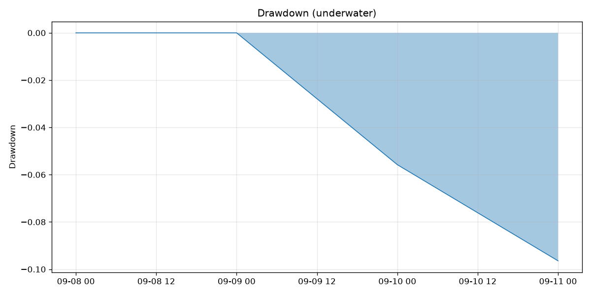
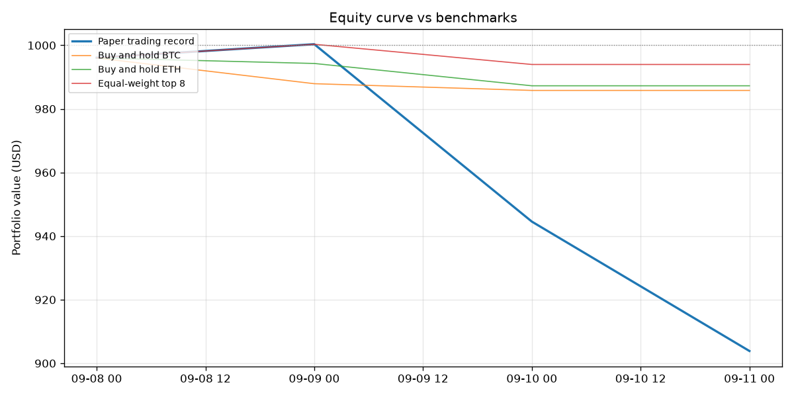
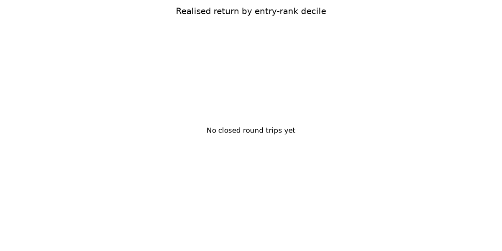
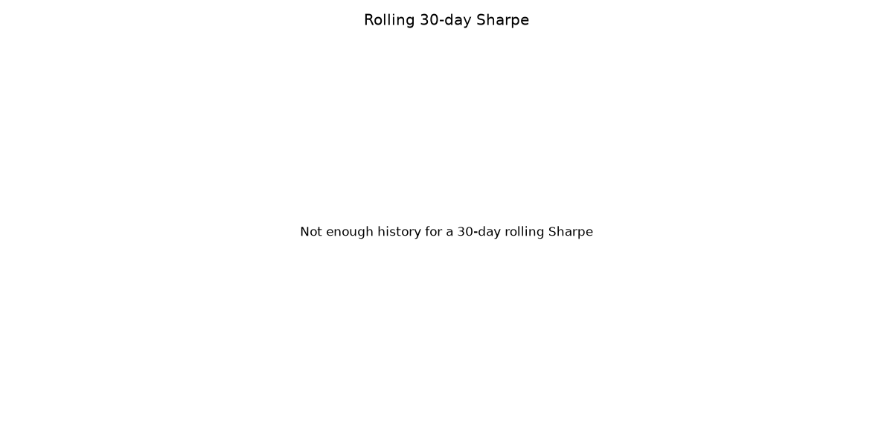

# Paper trading record

Generated 2026-09-11. Starting capital $1,000.00.

> **4 daily observations.** Under 30 days there is no meaningful distinction between edge and noise here; read the numbers below as a description of what happened, not as evidence of anything.

## Performance

| Series | Days | Total | Annualised | Vol | Sharpe | Sortino | Max DD | Calmar |
| --- | ---: | ---: | ---: | ---: | ---: | ---: | ---: | ---: |
| Paper trading record | 4 | -9.26% | -100.00% | 60.45% | -19.04 | -12.09 | -9.64% | -10.37 |
| Buy and hold BTC | 4 | -1.02% | -71.44% | 8.05% | -15.52 | -11.00 | -1.02% | -69.72 |
| Buy and hold ETH | 4 | -0.88% | -65.82% | 7.03% | -15.23 | -10.90 | -0.88% | -74.93 |
| Equal-weight top 8 | 4 | -0.21% | -22.92% | 10.18% | -2.52 | -2.12 | -0.63% | -36.11 |

## Trading

| Measure | Value |
| --- | ---: |
| Trades | 8 |
| Turnover per rebalance | 98.29% |
| Win rate (closed round trips) | n/a |
| Average holding period | nan days |
| Fees | $0.98 |
| Slippage | $2.93 |
| Total cost drag | $3.91 (0.39% of starting capital) |
| BTC correlation (daily) | -0.90 |

## Return by entry rank

_No closed round trips yet._

## Charts

### Drawdown

### Equity curve vs benchmarks

### Return by entry-rank decile

### Rolling 30-day Sharpe

## Notes

- This is a forward record: every trade was priced from a snapshot taken before the fill, so none of it is fitted to data it could not have seen.
- CoinGecko volume figures include wash trading on some venues, which flatters the liquidity factor for coins listed on the worst offenders.
